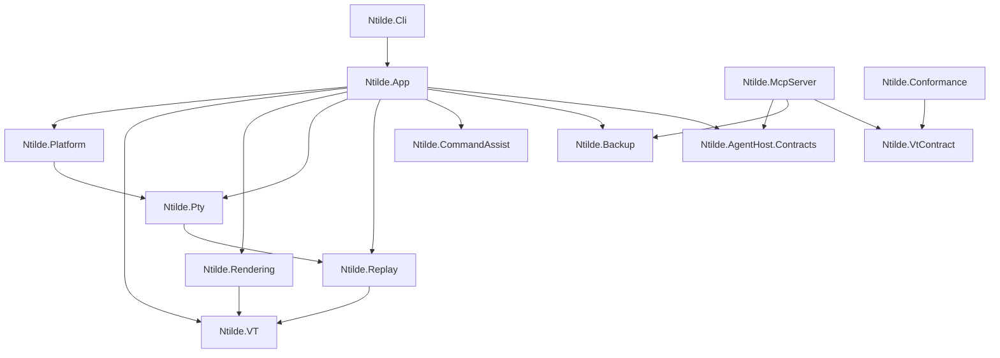

# Ntilde


**Ntilde** is a modern, cross-platform terminal emulator focused on

**correctness, performance, and predictability**.


Built with:

- **.NET 10**
- **Avalonia UI**
- **Skia (GPU-accelerated rendering)**
- **Rust-based PTY backend**

Supported platforms: **Windows · Linux · macOS**


---

### ✨ Why Ntilde?

Most terminal emulators optimize for speed or features. Ntilde focuses on something different:

-   🧪 **Deterministic rendering**\
    Same input → same output. Always. Enables reliable testing and replay.
-   📼 **Replay-driven debugging**\
    Record terminal sessions and replay them with pixel-level consistency.
-   ✅ **VT correctness first**\
    Built with conformance and standards in mind---not best-effort rendering.
-   ⚡ **GPU-accelerated rendering**\
    Smooth, modern rendering pipeline using Skia.
-   🧩 **Extensible architecture**\
    Designed for future workflows (cloud, automation, AI-assisted tooling).
-   🤖 **Built for AI agents**\
    An opt-in MCP server lets Claude Code and other agents observe your live terminal sessions --- and, behind a separate opt-in, drive them.

> **Terminal correctness is enforced by automated tests, not guesswork.**

That principle shows up everywhere: VT behavior is measured against a
conformance matrix, the renderer is gated by performance contracts, and
replay parity prevents silent behavioral drift.

---

## Install

GitHub release assets are produced as Native AOT bundles for `win-x64`,
`linux-x64`, and `osx-arm64`. Every release runs the gating unit-test lane on
all three OSes before any bundle is published.

### Coming from NovaTerminal

Ntilde is NovaTerminal renamed; nothing else changed in this release. What that means for an
existing install:

- **Settings carry over.** On first launch Ntilde copies settings, themes, connection profiles,
  workspaces, snippets, backups and history from `NovaTerminal` into its own data folder
  (`%LOCALAPPDATA%\ntilde` on Windows, `~/.local/share/ntilde` elsewhere). The old folder is
  left untouched; delete it when you are happy.
- **Saved passwords do not.** Keychain, Credential Manager and Secret Service entries are stored
  under the new name. Re-enter SSH passwords once; the profiles themselves are already there.
- **The old app will not update itself into Ntilde.** Install Ntilde from the links below, then
  uninstall NovaTerminal. Debian and Arch packages supersede `novaterminal` automatically.
- **Package names changed:** `winget install benyblack.ntilde`, `ntilde-bin` on the AUR, `.deb`
  package `ntilde`. The command is now `ntilde` (was `nova`).
- **Old files still open.** `.novabackup` bundles, `.novaws.json` workspace exports and `.rec`
  recordings from NovaTerminal import and replay unchanged.
- **Remote shell integration:** re-run the installer from Settings on each host; it writes
  `~/.ntilde-shell-integration.sh` (or, on PowerShell hosts, `~/.ntilde-shell-integration.ps1`).
  Remove the old `~/.nova-shell-integration.sh` loader line from your rc file by hand, or the old
  `. ~/.nova-shell-integration.ps1` loader line from `$PROFILE`.
- **Environment overrides** are renamed `NOVATERM_*` to `NTILDE_*` (for example
  `NTILDE_APPDATA_ROOT`).

**Windows**

- **Installer** — download `ntilde-Setup-win-x64-<tag>.exe` from the
  [latest release](https://github.com/benyblack/ntilde/releases/latest). Installs per-user
  (no admin prompt), adds Start Menu and Desktop shortcuts, and checks for updates in the
  background — a new version downloads quietly and is applied when you accept the prompt and
  restart. Never a surprise restart. Automatic checks can be turned off in Settings.
- **Portable** — download `ntilde-win-x64-<tag>.zip` and extract it anywhere. No updater.
- **winget** — `winget install benyblack.ntilde` (portable package).

The installer and the executables are **not code-signed yet** ([#91](https://github.com/benyblack/ntilde/issues/91)),
so SmartScreen will warn on first run. Choose *More info → Run anyway*.

**macOS**

- **macOS (Apple Silicon)** — download `ntilde-Setup-osx-arm64-<tag>.pkg` from the
  [latest release](https://github.com/benyblack/ntilde/releases/latest) and run it;
  it installs into `/Applications` (or `~/Applications`) as a proper `Ntilde.app`
  bundle. Alternatively grab `ntilde-osx-arm64-<tag>.zip`, open it, and drag
  `Ntilde.app` to `/Applications`.

macOS builds installed via the `.pkg` check for updates in the background and apply them
on restart, same as Windows. If the app lives in `/Applications`, macOS will ask for your
password once per update.

Releases built while the macOS signing secrets are unset (see
[packaging/macos](packaging/macos/README.md), tracking
[#91](https://github.com/benyblack/ntilde/issues/91)) are **not code-signed or
notarized**, so Gatekeeper blocks their first launch. On macOS 13+:

1. Try to open `Ntilde` once (it will be blocked — that's expected).
2. Open **System Settings → Privacy & Security**, scroll down, and click **Open Anyway**.
3. Confirm — macOS remembers the approval for subsequent launches and updates.

From a terminal, the one-liner equivalent is
`xattr -cr /Applications/Ntilde.app`.

**Linux**

Requires **glibc 2.35 or newer** — Ubuntu 22.04+, Debian 12+, Fedora 36+, or a current
rolling distro. Debian 11 and RHEL 8/9 are not supported.

**AppImage** (recommended — updates itself):

```sh
# Replace <tag> with the latest release, and x64 with arm64 on ARM machines.
curl -LO https://github.com/benyblack/ntilde/releases/download/<tag>/ntilde-linux-x64-<tag>.AppImage
chmod +x ntilde-linux-x64-<tag>.AppImage
mkdir -p ~/Applications && mv ntilde-linux-x64-<tag>.AppImage ~/Applications/
~/Applications/ntilde-linux-x64-<tag>.AppImage
```

Keep it somewhere you can write, such as `~/Applications` — the app updates itself by
rewriting the AppImage, which it cannot do from a root-owned path like `/opt`.

Ubuntu 22.04 and later ship no FUSE 2 by default, which AppImages need. Either
install it (`sudo apt install fuse`, which pulls in `libfuse2` — `libfuse2` alone
supplies only the library, not the `fusermount` binary the mount step needs) or
run with `--appimage-extract-and-run`.

**Debian / Ubuntu package** (system integration; update via your package manager):

The `.deb` filename is not the release tag substituted into a template, unlike
every other asset on this page. `build-deb.sh` always appends a Debian revision
(`-1`), and for a prerelease tag it also turns the `-` before the prerelease
label into `~` — dpkg reads the *last* `-` in a version as the revision
separator, so a prerelease left as `-beta.1` would parse as upstream `0.5.0`
revision `beta.1` and sort *above* the eventual `0.5.0-1` final release; `~`
sorts before everything, so `~beta.1-1` correctly sorts below it. `v0.5.3` ships
as `ntilde_0.5.3-1_amd64.deb`; `v0.5.0-beta.1` is built as
`ntilde_0.5.0~beta.1-1_amd64.deb`, but GitHub replaces `~` with `.` in
release asset names, so the file you'll actually see on the releases page for a
prerelease is named `ntilde_0.5.0.beta.1-1_amd64.deb` — the package's
internal `Version:` field (what dpkg reads) still carries the `~`, so
installation works either way; stable tags have no `~` to sanitize, so this
doesn't affect them. That's exactly why you shouldn't construct the filename
yourself — copy it verbatim from the [releases page](https://github.com/benyblack/ntilde/releases):

```sh
curl -LO https://github.com/benyblack/ntilde/releases/download/<tag>/<exact .deb filename from the release page>
sudo apt install ./<same filename>
ntilde
```

On ARM machines, grab the `arm64` asset instead of `amd64` — the `.deb` uses
Debian architecture names (`amd64`/`arm64`), not the `x64`/`arm64` RID names the
AppImage and tarball below use.

Installs `ntilde` on your PATH, an app-menu entry, and `man ntilde`. The in-app updater is
inactive for package installs by design.

**Portable tarball** (no integration):

```sh
# Replace <tag> with the latest release, and x64 with arm64 on ARM machines.
curl -LO https://github.com/benyblack/ntilde/releases/download/<tag>/ntilde-linux-x64-<tag>.tar.gz
tar -xzf ntilde-linux-x64-<tag>.tar.gz && ./Ntilde
```

Ntilde is not registered as your default terminal. To do that yourself after
installing the `.deb`, see `man ntilde`.

For details on what each Linux package contains and its known limitations, see
[packaging/linux](packaging/linux/README.md).

For build steps, jump to [Build & test](#build--test) below.

---

## Features

### Terminal core

- VT / ANSI parsing measured against a conformance matrix
- Alternate screen support (`vim`, `less`, `htop`)
- Scrollback buffer
- Stable resize & reflow
- Cell-based buffer model
- Thread-safe, crash-resistant PTY backend

### UI

- Tabs and split panes, reorderable by drag or by `Ctrl+Shift+PageUp` / `Ctrl+Shift+PageDown`
- Vertical tab sidebar (`Ctrl+Shift+L`) with per-tab status, agent-activity chips, and a live output preview
- Agent Output panel — renders a command's output as markdown beside the pane, streaming as it arrives
- Command palette
- Search overlay
- Profiles (local & SSH)
- Bundled themes (Dracula, Nord, Gruvbox, Tokyo Night, Catppuccin Mocha, Solarized, GitHub, Monokai, OneHalf, Cobalt2), custom themes, and font configuration
- Bundled fonts, so a fresh install renders correctly with no system font installed: JetBrains Mono NL by default,
  Cascadia Mono PL alongside it, and a symbols-only Nerd Font loaded as a fallback so prompt icons work under
  whichever face you pick
- Live settings (no restart)

### Command Assist

Suggestions anchored to what the shell actually reports, rather than to a guess
about where the prompt ends — built on OSC 133 shell-integration marks.

- Reads the live command line from the terminal grid, not a shadow copy
- History search, snippet management, and a tldr-derived command catalogue
- Fix mode proposes a correction from a failed command's own output
- Passive suggestion bubble with rebindable shortcuts
- One-line shell-integration installer for remote hosts, with mark detection over SSH
- Still captures commands in sessions that emit no marks at all

### Configuration backup & restore

- Export settings, themes, connections, workspaces, policy and snippets to a
  single portable `.ntildebackup` file, and import it on another machine
- Six independently selectable categories; import merges or replaces
- Automatic background snapshots, deduplicated by content hash and retention-capped
- A snapshot is taken before every import and restore, so both are reversible
- Available from **Settings → Backup & Restore**, the command palette, and the CLI
  (`backup export|import|list|restore`); agents get read-only export and list MCP tools

> Connection passwords are **not** included in a bundle. They live in the OS
> credential store, not in the config folder, so imported SSH profiles need their
> passwords re-entered on first connect. See
> [`docs/CONFIG_STORAGE_CONTRACT.md`](docs/CONFIG_STORAGE_CONTRACT.md).

### Graphics & inline images

- **Sixel Graphics** (verified with `libsixel`, `lsix`, `gnuplot`)
- **iTerm2 Inline Images** (verified with `imgcat`, `test_iterm2.py`)
- **Kitty Graphics Protocol** (native on Linux/macOS; tunneled mode on Windows)
- **Proper ConPTY synchronization** — images render inline with prompts

### Native SSH

The in-process SSH client is the **default backend for new profiles**; OpenSSH
remains selectable per profile, and stays the default for profiles that predate
the flip.

- SSH profiles with platform-vault credential storage (Windows Credential Manager, macOS Keychain, Linux Secret Service)
- Password, identity-file, and ssh-agent authentication
- Multi-hop jump chains of any length
- Local, remote, and dynamic port forwarding
- Keepalive
- Coalesced resize handling for fullscreen TUIs (vim, htop, tmux)
- Disconnect state surfaced in the terminal pane
- Runtime password memory (opt-in, session-scoped)
- Native SFTP transfers and a pane-local remote-files sidebar

### Cross-platform parity
Ntilde guarantees identical terminal behavior across operating systems
for VT interpretation, buffer state, wrapping & reflow, and search semantics.
Platform-specific differences are limited to window chrome, blur/transparency,
global hotkeys, and credential storage backends.

### Agent access (MCP)

A local, stdio [Model Context Protocol](https://modelcontextprotocol.io) server
(`Ntilde.McpServer`) exposes Ntilde to AI coding agents (Claude Code, Claude
Desktop, VS Code, …):

- **Repo / dev-companion tools** — read-only and offline: project docs, VT/ANSI conformance
  data, and theme / SSH-profile / settings JSON validators.
- **Observe** (opt-in, default off) — `list_sessions`, `read_screen`, `read_scrollback`,
  `get_session_status`, `wait_for_events`, `export_replay`, `capture_screen`: read live sessions
  deterministically, as text or as a PNG - re-rendered offscreen from the buffer, or photographed
  from the screen with `mode=live`.
- **Act** (a *separate* opt-in, on top of observe) — `send_input`, `spawn_session`,
  `close_session`: type into, open, and close sessions. SSH targets additionally require a
  per-profile allowlist, and every acting call — allowed or denied — is recorded in an in-app
  activity journal.

With both toggles off there is no live endpoint at all. See the
[MCP server README](src/Ntilde.McpServer/) and the
[acting threat model](docs/agent-host/2026-07-12-acting-threat-model.md).

---

## Use with AI agents (MCP)

Build the server, then register it with your MCP client, pointing at the **built DLL** (launch
the compiled DLL — never `dotnet run`, which corrupts the stdio stream):

```bash
scripts/build.ps1 build -c Release src/Ntilde.McpServer   # or scripts/build.sh
```

**Claude Code:**

```bash
claude mcp add ntilde -- dotnet "<path-to-repo>/src/Ntilde.McpServer/bin/Release/net10.0/Ntilde.McpServer.dll"
```

For **Claude Desktop / VS Code**, add the same `command`/`args` to the client's MCP config.

The repo / dev-companion tools work immediately. To expose live sessions, enable
**Settings → Agent access (observe)** in Ntilde; to let an agent type into, spawn, or
close sessions, also enable the **Agent access (act)** sub-toggle (and allowlist any SSH
profiles you want reachable). Both are off by default.

---

## User documentation

- [User manual](docs/USER_MANUAL.md)
- [Tabs user manual](docs/TABS_USER_MANUAL.md)
- [Image protocol support](docs/IMAGE_PROTOCOL_SUPPORT.md)
- [SSH roadmap](docs/SSH_ROADMAP.md)

---

## For contributors & developers

### Architecture

Ntilde is organized into focused class libraries under `src/` with an
acyclic dependency graph.

- **[`src/Ntilde.App`](src/Ntilde.App/)** — Avalonia/UI layer: windows, themes, settings, orchestration.
- **[`src/Ntilde.Platform`](src/Ntilde.Platform/)** — Shared runtime primitives: input, paths, process, SSH.
- **[`src/Ntilde.VT`](src/Ntilde.VT/)** — Virtual Terminal engine: frame-agnostic parser logic and buffer state.
- **[`src/Ntilde.Rendering`](src/Ntilde.Rendering/)** — SkiaSharp rendering: framework-agnostic text shaping and GPU glyph caching.
- **[`src/Ntilde.Pty`](src/Ntilde.Pty/)** — Native OS integration and PTY session management.
- **[`src/Ntilde.Replay`](src/Ntilde.Replay/)** — Deterministic session recording and playback.
- **[`src/Ntilde.CommandAssist`](src/Ntilde.CommandAssist/)** — Command Assist domain, ranking, history/snippet storage, and shell integration. Avalonia-free by design; the App owns only its views.
- **[`src/Ntilde.Backup`](src/Ntilde.Backup/)** — `.ntildebackup` export/import, automatic snapshots, and the category-to-path catalogue. A leaf, so the MCP server can reference it without reaching into the app.
- **[`src/Ntilde.VtContract`](src/Ntilde.VtContract/)** — the machine-readable VT capability catalogue (`vt-capabilities.json`) and its schema validation, shared by the conformance tool, the parser tests, and the MCP dev tools.
- **[`src/Ntilde.Conformance`](src/Ntilde.Conformance/)** — VT conformance matrix tooling and report generation.
- **[`src/Ntilde.Cli`](src/Ntilde.Cli/)** — console-subsystem twin of the (WinExe) app for headless tooling: `vt-report`, headless replay (`--replay <file>`), and the SSH askpass helper.
- **[`src/Ntilde.AgentHost.Contracts`](src/Ntilde.AgentHost.Contracts/)** — zero-dependency wire contracts for the agent-host observe channel (shared by App and McpServer).
- **[`src/Ntilde.McpServer`](src/Ntilde.McpServer/)** — stdio-only MCP server exposing project docs, config validators, VT conformance data, and (opt-in) live terminal sessions to AI tooling: observe by default, and — behind a separate explicit opt-in — act (type into / open / close sessions).

Validation:

- **[`tests/Ntilde.App.Tests`](tests/Ntilde.App.Tests/)** — primary unit and integration suite (Avalonia Headless UI), including replay, render-metrics, golden-PNG, and shell-integration lanes.
- **[`tests/Ntilde.VT.Tests`](tests/Ntilde.VT.Tests/)**, **[`tests/Ntilde.Rendering.Tests`](tests/Ntilde.Rendering.Tests/)**, **[`tests/Ntilde.Platform.Tests`](tests/Ntilde.Platform.Tests/)**, **[`tests/Ntilde.McpServer.Tests`](tests/Ntilde.McpServer.Tests/)** — deterministic per-module suites (the blocking CI lane).
- **[`tests/Ntilde.Architecture.Tests`](tests/Ntilde.Architecture.Tests/)** — the key invariants of the graph below are *enforced*, not aspirational: NetArchTest checks at IL, csproj, and namespace level.
- **[`tests/Ntilde.Benchmarks`](tests/Ntilde.Benchmarks/)** — performance benchmarks and the SharpFuzz/libFuzzer harness.
- **[`tests/Ntilde.ExternalSuites`](tests/Ntilde.ExternalSuites/)** — manual vttest / native-SSH scenario driver.



`CommandAssist`, `Backup`, `VtContract` and `AgentHost.Contracts` are leaves with
zero project references, and that is what lets `McpServer` share code with the
app without acquiring a path into `App`, `VT`, `Pty` or `Rendering`.

Enforced invariants (`Ntilde.Architecture.Tests`): `VT` is a leaf with zero project references; `Pty` must **not** depend on `VT` (the PTY layer delivers raw bytes only); `Replay` and `Rendering` reference exactly `VT`; no production assembly references test libraries. The remaining edges above are documented from the csproj references but not individually asserted.

---

### Engineering programs

#### Active work

- **Agent host program** — the accepted strategic direction
  ([`docs/agent-host/DIRECTION.md`](docs/agent-host/DIRECTION.md)): a
  session-facing MCP surface so AI agents can observe, query status of, and
  — with explicit, separate permission — act inside live terminal sessions
  (`send_input` / `spawn_session` / `close_session`, gated by an "Agent access
  (act)" opt-in on top of observe, a per-profile SSH allowlist, and a visible
  activity journal; threat model in
  [`docs/agent-host/2026-07-12-acting-threat-model.md`](docs/agent-host/2026-07-12-acting-threat-model.md)),
  with deterministic replay as the debugging story. Debug what your agent did,
  frame by frame: with both opt-in toggles enabled, an agent can call
  `ntilde.export_replay` to save a session's recent output (never
  input — typed keys are not retained) as a standard `.rec` file, and anyone
  can re-render it deterministically with
  `Ntilde.Cli --replay <file> [--attributes]`. When the pixels are what
  matter — inline images, TUI layout, a rendering bug — `ntilde.capture_screen`
  renders a pane to a PNG offscreen from its buffer, so a minimized or occluded
  window captures identically and nothing outside the pane can appear in the
  image - with a caller-named `scale` for text large enough to read back, and a
  `mode=live` that photographs the pane as drawn when that is what you need.
- **VT conformance program** — every supported VT/ANSI feature is tracked in a
  matrix; a dedicated CI lane regenerates the report and fails on regressions.
  See [`docs/vt_coverage_matrix.md`](docs/vt_coverage_matrix.md) and
  [`docs/ghostty-gaps/vt_conformance_tooling.md`](docs/ghostty-gaps/vt_conformance_tooling.md).
- **Ghostty gap tracking (regression gate)** — comparison against Ghostty's
  behavior is maintained as a regression gate; remaining matrix gaps are
  closed when real TUI or agent workflows hit them. See
  [`docs/ghostty-gaps/`](docs/ghostty-gaps/) and
  [`docs/vt_ghostty_gap_matrix.md`](docs/vt_ghostty_gap_matrix.md).
- **Native SSH** — an in-process, cross-platform SSH client, now the default
  backend for new profiles, with VT correctness, resize coalescing, multi-hop
  jump chains, local/remote/dynamic forwarding, ssh-agent authentication,
  keepalive, and runtime password memory. See
  [`docs/SSH_ROADMAP.md`](docs/SSH_ROADMAP.md) and
  [`docs/native-ssh/`](docs/native-ssh/).

#### Ongoing guardrails

- **Rendering performance contract** — snapshot-only rendering boundary,
  replay parity, seam safety under fractional DPI, and conservative perf
  ceilings enforced by CI. See
  [`docs/RENDERING_PERF_CONTRACT.md`](docs/RENDERING_PERF_CONTRACT.md).
  Historical design context:
  [`docs/gpu-hardening/`](docs/gpu-hardening/).
- **Configuration storage contract** — where user state lives, what an update
  versus an uninstall deletes, why the Velopack `packId` deliberately differs
  from the app name, and why secrets are not in the config folder. Read before
  building anything that reads or writes user configuration (backup/restore,
  export/import, sync, migrations). See
  [`docs/CONFIG_STORAGE_CONTRACT.md`](docs/CONFIG_STORAGE_CONTRACT.md).

---

### Build & test

Prerequisites:

- .NET 10 SDK. The solution targets `net10.0`.
- Rust stable toolchain installed via `rustup`. Both native crates use Rust edition 2024, so `rustc` and `cargo` must be on `PATH`.
- macOS: Xcode Command Line Tools (`xcode-select --install`) so Cargo has an available system linker.
- Windows: Rust's default `stable-x86_64-pc-windows-msvc` toolchain expects the MSVC build tools to be installed.

Verify the toolchain before building:

```bash
dotnet --version
rustc --version
cargo --version
```

Notes:

- `dotnet build` for `src/Ntilde.App` triggers `cargo build --release` for the native PTY and native SSH libraries automatically.
- The CLI project references the app project, so `dotnet build` and `dotnet test` both require the Rust toolchain unless you explicitly set `SKIP_RUST_NATIVE_BUILD=1` for a downstream job that already has the native artifacts.
- If a clean clone fails during Cargo's `build-script-build` step on macOS, first confirm `rustc`/`cargo` are installed and that Xcode Command Line Tools are available. If the failure happened after a partial build, remove `src/Ntilde.App/native/target` and `src/Ntilde.App/native/rusty_ssh/target` and retry.

Build — **always through the wrapper scripts**, never raw `dotnet build`:

```bash
# Linux / macOS / Git Bash
scripts/build.sh build -c Release
```

```powershell
# Windows / PowerShell
scripts\build.ps1 build -c Release
```

The wrappers pass `-nodeReuse:false` and set `DOTNET_CLI_USE_MSBUILD_SERVER=0`.
Without them, MSBuild leaves daemons holding the caller's stdout/stderr handles,
and any build whose output is captured by a parent process (CI runners, agents,
test harnesses) hangs indefinitely — usually looking stuck in `BuildCliShim`.
Details in [`CLAUDE.md`](CLAUDE.md).

Run tests (same filter as the gating CI unit lane):

```bash
scripts/build.sh test -c Release --filter "Category!=Replay&Category!=RenderMetrics&Category!=PtySmoke&Category!=Stress&Category!=GoldenSharedPng"
```

CI applies that filter per test project rather than across the solution, and
runs the App.Tests `Lane=PlatformBoot` tests in a separate process. Per-project
runs are also the fast local loop — a whole-solution run takes tens of minutes
because of the headless Avalonia suite.

Use `ci/run.sh` (Linux/macOS) or `ci/run.ps1` (Windows) for the full local
CI-style sequence. Both scripts assume the .NET and Rust toolchains are already installed.

### Native AOT publish

Ntilde is configured for **Native AOT** publish in
[`src/Ntilde.App/Ntilde.App.csproj`](src/Ntilde.App/Ntilde.App.csproj).
The project supports `win-x64`, `linux-x64`, and `osx-arm64` publish targets.
The release workflow publishes Native AOT bundles for those targets to the
corresponding GitHub Release.

Example publish command:

```bash
dotnet publish src/Ntilde.App/Ntilde.App.csproj -c Release -r win-x64 --self-contained true -p:PublishAot=true -o artifacts/publish/win-x64
```

Swap `win-x64` for `linux-x64` or `osx-arm64` as needed.

---

### Running GitHub CI locally with `act`

Ntilde workflows exchange artifacts between jobs (native binaries and
test results). When running via `act`, enable its artifact server or
artifact upload/download steps will fail.

Recommended command:

```bash
act pull_request -P ubuntu-latest=catthehacker/ubuntu:act-latest --artifact-server-path .act-artifacts
```

Notes:

- `--artifact-server-path` is required for `actions/upload-artifact` / `actions/download-artifact`.
- To bypass Rust rebuild inside downstream .NET jobs, set `--env SKIP_RUST_NATIVE_BUILD=1`.

---

### Project status

Under active development. Current focus and upcoming milestones are tracked
in [`docs/ROADMAP.md`](docs/ROADMAP.md).

License: [`MIT`](LICENSE).

---

### Contributing

Contributions are welcome. Ntilde has a strong correctness culture —
terminal core invariants are enforced and automated tests gate changes. See
[`CONTRIBUTING.md`](CONTRIBUTING.md) for details, and
[`docs/reviews/`](docs/reviews/) for periodic deep code reviews with the
current known-issues backlog.

---

### Acknowledgements

Thanks to [**Greptile**](https://www.greptile.com/) for granting Ntilde
free access to their AI code review as an open source project. It reviews every
pull request here, and that extra pair of eyes is a real help on a codebase
where correctness is the whole point.

---

## Philosophy

Ntilde aims to be:

- **boring in behavior**
- **predictable under stress**
- **fast without shortcuts**
- **cross-platform without divergence**

A terminal you can trust.
